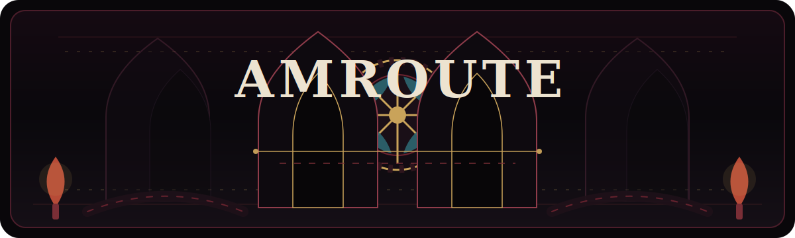
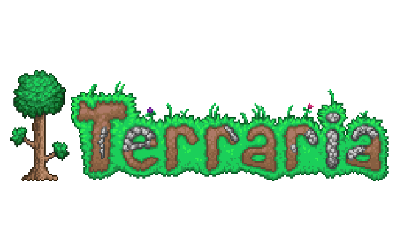
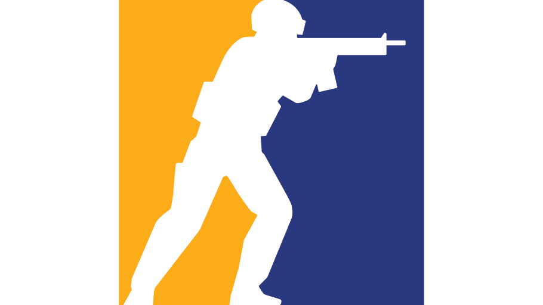
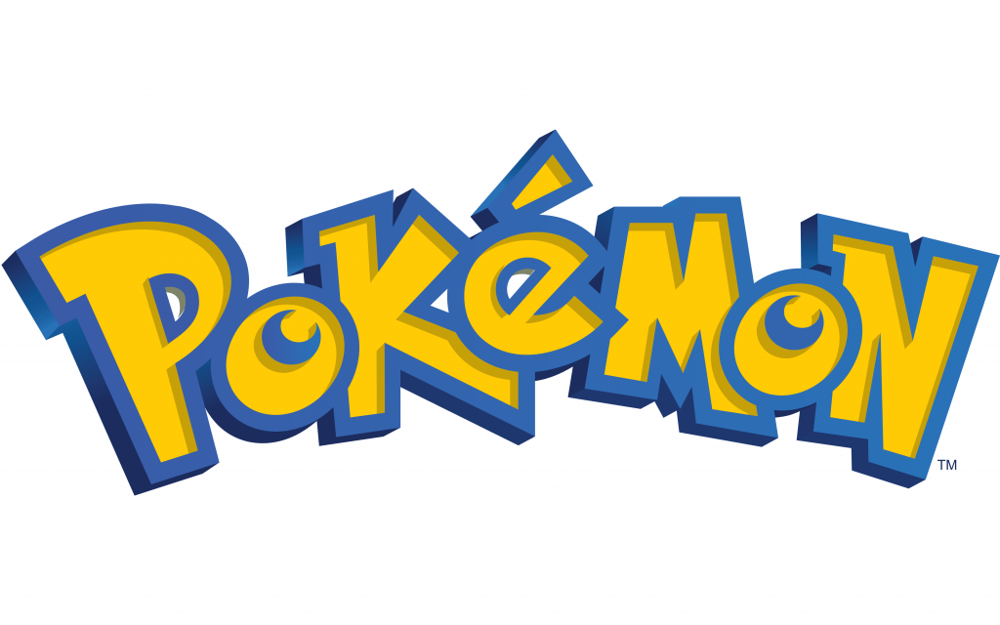
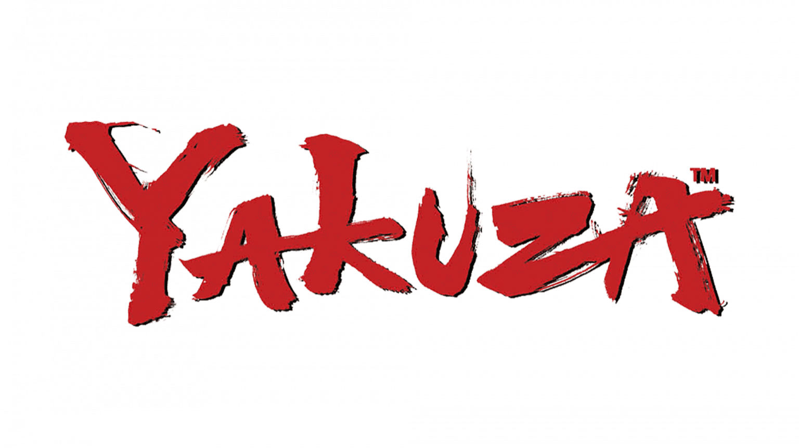
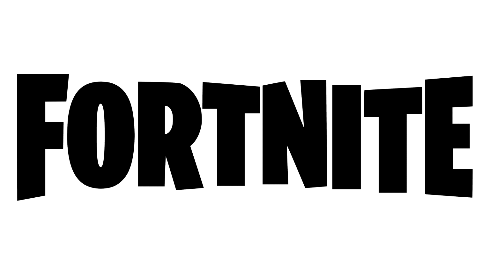
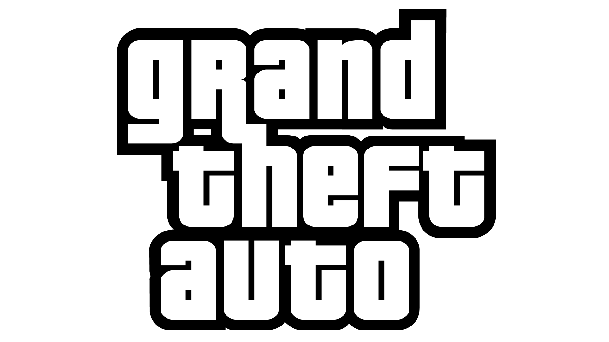

  

<h1 align="center">AMROUTE</h1>

  <strong>Tongji University 2027 · Software Engineering · Machine Intelligence</strong>

  
  
  

---

### Links / 传送门

  
  

### Now Researching / 目前正在研究

<table>
  <tr>
    <td width="50%">
      <strong>Frontend Development</strong> 
      Vue 3, component design, interaction details, and building interfaces that feel clear and responsive.
    </td>
    <td width="50%">
      <strong>Reinforcement Learning</strong> 
      Agents, reward design, decision processes, and the fun part where algorithms start learning routes.
    </td>
  </tr>
</table>

### Tech Stack / 技术栈

  
  

### Heatmap / 代码热力图

  

  
  

### Game Log / 资深游戏爱好者

<table>
  <tr>
    <td align="center" width="25%">
       
      <strong>Terraria</strong> 
      sandbox · survival · exploration
    </td>
    <td align="center" width="25%" bgcolor="#f6f8fa">
       
      <strong>Dead by Daylight</strong> 
      tension · chase · mind games
    </td>
    <td align="center" width="25%">
       
      <strong>CS2</strong> 
      aim · utility · team play
    </td>
    <td align="center" width="25%">
       
      <strong>Pokemon</strong> 
      collecting · strategy · adventure
    </td>
  </tr>
  <tr>
    <td align="center" width="25%">
       
      <strong>Yakuza</strong> 
      story · action · street drama
    </td>
    <td align="center" width="25%" bgcolor="#f6f8fa">
       
      <strong>Fortnite</strong> 
      builds · aim · chaos
    </td>
    <td align="center" width="25%">
       
      <strong>Grand Theft Auto</strong> 
      open world · driving · missions
    </td>
    <td align="center" width="25%" bgcolor="#f6f8fa">
       
      <strong>Final Fantasy</strong> 
      fantasy · story · adventure
    </td>
  </tr>
</table>

---

  mapping ideas, training agents, and queueing one more game

